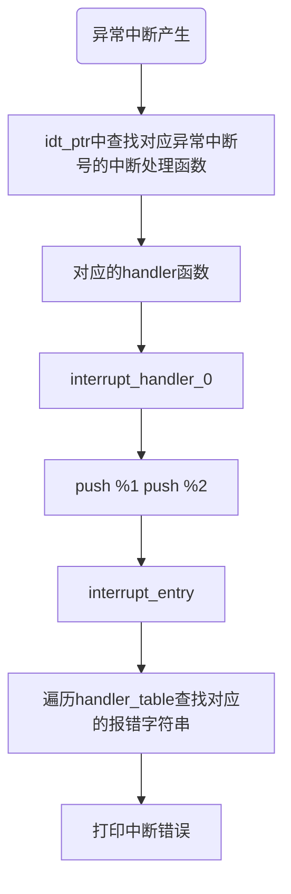

## 1. 中断分类

- 外中断   硬件中断
- 异常     cpu无法执行下去了之后，就出发异常
- 软中断   系统调用

中断是应用程序与操作系统之间的交流方式，可能会发生特权级的切换

## 2. 中断实现过程

```asm

[bits 32]
; 中断函数入口

section .text

extern printk

global interrupt_handler ; 导出中断处理函数

interrupt_handler:

    xchg bx, bx

    push message ;打印中断信息
    call printk
    add esp, 4

    xchg bx, bx

    iret 

section .data

message:
    db "default interrupt", 10, 0 

```

## 3. 异常

- 故障
- 陷阱
- 终止

#### 


#### 3.1故障 Fault

这种错误可被修复，属于最轻的异常

#### 3.2 陷阱 Trap

此异常用于调试

#### 3.4 禁止

最严重异常，系统无法正常运转

#### 3.5 调试器

- 不能影响程序运行

#### 3.6 异常中断触发框架




