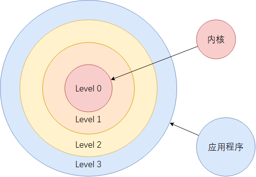

# 任务状态段简介

## 任务特权级环 (Protection Rings)



## 任务状态段

一个任务分为两个部分：

- 执行空间
- 状态空间

**任务状态段 (TSS Task State Segment)** 是 IA32 中一种二进制数据结构，保存了某个任务的信息，保护模式中 TSS 主要用于硬件任务切换，这种情况下，每个任务有自己独立的 TSS，对于软件的任务切换，也通常会有一两个任务状态段，使得任务从在中断时，能从 **用户态(Ring3) 转到 内核态(Ring0)**；

在硬件任务切换中，任务状态段保存了很多寄存器的信息，任务状态段的结构如下：


```c++
typedef struct tss_t
{
    u32 backlink; // 前一个任务的链接，保存了前一个任状态段的段选择子
    u32 esp0;     // ring0 的栈顶地址
    u32 ss0;      // ring0 的栈段选择子
    u32 esp1;     // ring1 的栈顶地址
    u32 ss1;      // ring1 的栈段选择子
    u32 esp2;     // ring2 的栈顶地址
    u32 ss2;      // ring2 的栈段选择子
    u32 cr3;
    u32 eip;
    u32 flags;
    u32 eax;
    u32 ecx;
    u32 edx;
    u32 ebx;
    u32 esp;
    u32 ebp;
    u32 esi;
    u32 edi;
    u32 es;
    u32 cs;
    u32 ss;
    u32 ds;
    u32 fs;
    u32 gs;
    u32 ldtr;          // 每个任务自己的局部描述符选择子
    u16 trace : 1;     // 如果置位，任务切换时将引发一个调试异常
    u16 reversed : 15; // 保留不用
    u16 iobase;        // I/O 位图基地址，16 位从 TSS 到 IO 权限位图的偏移
    u32 ssp;           // 任务影子栈指针，防止缓冲区溢出攻击
} _packed tss_t;
```

硬件任务切换主要和任务门有关，使得任务切换时，CPU 可以自动保存任务上下文，但是这样干会很低效，所以现代操作系统一般不会用这种方法，而且为了更高的可移植性，也更应该使用软件的方式来做任务切换。

## 任务状态段描述符

系统段和门描述符类型，当 segment = 0 时

| 类型 | 描述             |
| ---- | -------------- |
| 0000 | 保留             |
| 0001 | 16 位 TSS (可用) |
| 0010 | LDT              |
| 0011 | 16 位 TSS (忙)   |
| 0100 | 16 位 调用门     |
| 0101 | 任务门           |
| 0110 | 16 位 中断门     |
| 0111 | 16 位 陷阱门     |
| 1000 | 保留             |
| 1001 | 32 位 TSS (可用) |
| 1010 | 保留             |
| 1011 | 32 位 TSS (忙)   |
| 1100 | 32 位 调用门     |
| 1101 | 保留             |
| 1110 | 32 位 中断门     |
| 1111 | 32 位 陷阱门     |


任务状态段描述符，描述了当前正在执行的任务，B 表示busy 位， B 位为 0 时，表示任务不繁忙， B 位为 1 时，表示任务繁忙。

CPU 提供了 TR(Task Register) 寄存器来存储该描述符，加载描述符到 TR 寄存器中的指令是：

    ltr

我们使用 TSS 的主要作用是利用其中的 `ss0` 和 `esp0`，使得用户态的程序可以转到内核态。


- NT (Nested Task)
- IOPL (IO Privilege Level)

## 参考文献

1. <https://wiki.osdev.org/TSS>
2. Intel® 64 and IA-32 Architectures Software Developer's Manual Volume 3 Chapter 7 Task Management
3. [郑刚 / 操作系统真象还原 / 人民邮电出版社 / 2016](https://book.douban.com/subject/26745156/)
4. <https://en.wikipedia.org/wiki/Shadow_stack>
5. <https://www.intel.com/content/dam/develop/external/us/en/documents/catc17-introduction-intel-cet-844137.pdf>
6. <https://en.wikipedia.org/wiki/Control-flow_integrity>

